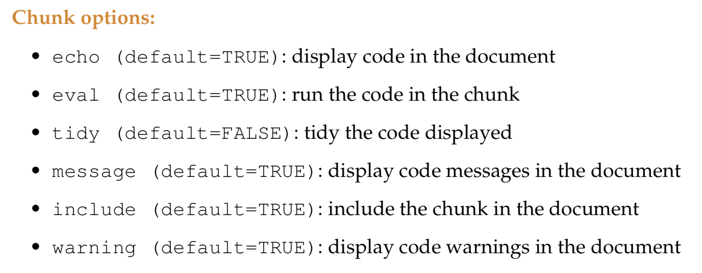

```{r setup, include=FALSE}
knitr::opts_chunk$set(echo = FALSE)
```

## R Markdown

This is an R Markdown document. Markdown is a simple formatting syntax for authoring HTML, PDF, and MS Word documents. For more details on using R Markdown see <http://rmarkdown.rstudio.com> or <https://www.markdownguide.org/basic-syntax/>.

When you click the **Knit** button a document will be generated that includes both content as well as the output of any embedded R code chunks within the document.\
Try it out now!

 \@ **Julien Stoehr** (Université Paris-Dauphine)

<br/><br/>

### Below is how our **Hello_Word** data could look like in R Markdown

------------------------------------------------------------------------

##### Friday, 21.10.2022

### 1 - Where to get help?

> -   R Tutorial for Beginners at [guru99](https://www.guru99.com/r-tutorial.html)
> -   R courses at [Babraham Bioinformatics](https://www.bioinformatics.babraham.ac.uk/training.html#advancedrtidy)
> -   R for [Data Science](https://r4ds.had.co.nz)
> -   R markdown at [RStudio](https://rmarkdown.rstudio.com/lesson-1.html)
> -   R Markdown [cheatsheet](https://www.markdownguide.org/cheat-sheet/)
> -   PDF file in the dropbox

### 2 - First steps in programming

<br/>

We will work with RStudio that is composed of 4 main windows/panels.\
The **Editor**, the **Console**, the **Environment** and the **History** window/panel.

In markdown,\
Two \*\* are used for **bold**\
One \* is used for *Italic*

Add two empty spaces at the end of a line to go to the next line. Compare:\
Line 1 Line 2\
with\
Line 1\
Line 2

<br/> <br/>

##### First instruction:

R instructions in a markdown file are written in a "chunk", as seen here below.\
Chunk can be added using the "+C" icon at the top right corner of this panel/editor.\
There is also a keyboard shortcut for it.

```{r Print Hello World!, eval= FALSE}
# Sentences written after "#" are comments. Comments are ignored during the execution of the code.
# print "Hello world!" on the screen.
print("Hello world!")
```

In the Markdown file, you can see the results of the command directly bellow the "r chunk". Importantly, you can name your chunks.\
It is useful to provide different names for the chunks.

So, what has been done here?\
We used the function **print()** with the instruction of printing a "string", which is a sequence of "characters".\
What does happen in the editor if you remove the second parenthesis? Do you see the red cross appearing? You can click on it and read the comment.

And what does happen if you press "enter" while the second parenthesis is missing?\
The structure of the script is made automatically for you in RStudio.\
You can add the second parenthesis in the second line of code.

```{r Command on several lines}
print("Hello world!"
      )
```

Usually, **""** and **()** appear both at the same time if you are creating your script in the RStudio editor.\
This is very useful and avoid errors due to missing brackets etc ...

Instruction are saved the history of the RStudio session (see "History").\
Using the **up** and **down** arrows, you can navigate through this history directly in the RStudio Console and recall a previous instruction.

We can load the string "Hello World!" into a so-called variable using an instruction called **assignment**. An assignment does not return anything in the console. It is just done.

```{r Assigment}
a <- "Hello world!"
# or
hello <- "Hello world!"
print(a)	             
print(hello)	         
```

### Any questions ???

<br/><br/><br/><br/>

### 3 - Data structure in R

Open the file **Data_Structure_in_R.Rmd**

<br/><br/><br/><br/>
